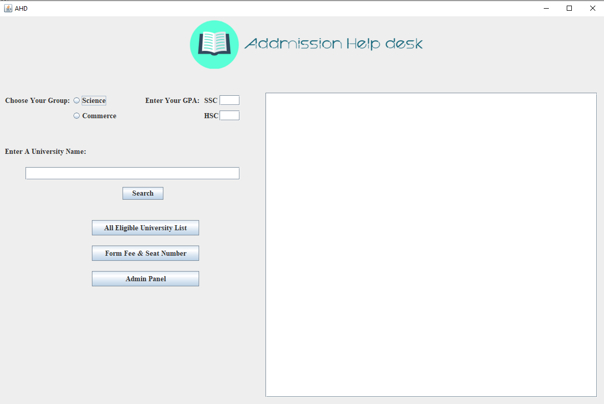

# Admission Help Desk (AHD)

Admission Help Desk (AHD) is a Java-based application designed to help students determine their eligibility for universities based on their SSC and HSC GPA scores. The application features a user-friendly GUI that allows users to select groups, enter GPA scores, search for universities, list eligible universities, view fees and seats, and update the university database.

## Features
- **Group Selection**: Choose between Science or Commerce
- **GPA Input**: Enter SSC and HSC scores
- **Search**: Check eligibility for specific universities
- **List**: Display all eligible universities
- **Fees & Seats**: View form fees and seat numbers
- **Admin Panel**: Add new universities to the database

## Prerequisites
- Java Development Kit (JDK) 8 or higher

## Getting Started

1. **Clone the Repository**:
    ```sh
    git clone https://github.com/Akram0007/Admission-Help-Desk.git
    cd Admission-Help-Desk
    ```

2. **Compile the Program**:
    ```sh
    javac AHD.java
    ```

3. **Run the Program**:
    ```sh
    java AHD
    ```

## Screenshot



## Hit the Star! ⭐
If you are planning to use this repo for learning, please hit the star. Thanks!

Authored by [Md. Akramul Islam](https://github.com/Akram0007).


